В этой папке лежат разные тулзы для работы с данными MARMOUSI.

### 1. read\_marmousi2 -- читалка оригинальной полной упругой модели MARMOUSI2

Качает эталонные данные от SEG с AWS, читает их, досыпает волшебных констант из оригинальной статьи, выдаёт 3 штуки numpy array. Потом ещё рисует - чисто чтобы увидеть глазами и для примера.

Требует поставить obspy (остальные модули вроде банальны).

На данный момент standalone tool на правах конспекта, где брать MARMOUSI2 и как читать формат SEGY. Когда и если MARMOUSI2 будет применяться, кажется разумным или отрефакторить read\_marmousi2 в некий модуль, или дописать в неё же генерацию расчётной сетки, которую разово задампить в роли эталона.

Запускается предельно просто, потом долго работает, в конце показывает картинки.
```
python3 read_marmousi2.py
```

Собственно, картинки:

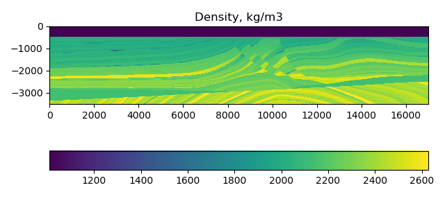
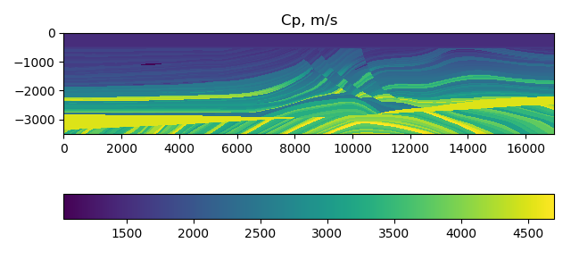
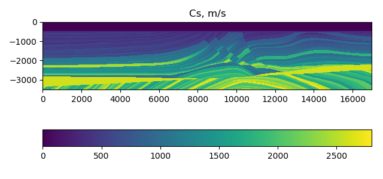


### 2. layered\_structures\_tools -- набор шаманской магии для генерации MARMOUSI-подобных структур

Использовать примерно так:
```python
import matplotlib.pyplot as plt

from marmousi.layered_structures_tools import get_mask

# The mask will be here
mask = get_mask(170, 35, 2, 8, 5, 10)

# Draw the mask
fig, ax = plt.subplots()
ax.set_aspect('equal')
im = ax.pcolormesh(mask.T)
fig.colorbar(im, ax=ax, orientation='horizontal')
ax.set_title("mask")
plt.show()
```

Значения параметров:
```python
    """
    Creates mask for layered structure. Each mask values belongs to (0, 1].
    It is supposed that lower values denote softer media, and higher values are for harder layers.
    However, the caller is free to interpret the values in any manner.
    :param x_size: int, horizontal size of the mask, in points
    :param y_size: int, vertical size of the mask, in points
    :param min_depth_step: int, proposed minimal *average* vertical depth of each layer
    :param max_depth_step: int, proposed maximal *average* vertical depth of each layer
    :param layers_sharpness: int, how sharp is the difference between neighbour layers (probably, belongs to (3, 10))
    :param horizon_trend: int, proposed *typical* layer vertical displacement in this horizontal area in question
    :return: np.array, the shape is (x_size, y_size), the values are (0, 1]
    """
```

Дальше можно запускать и залипать на картинки.

Например, из параметров `get_mask(170, 35, 1, 3, 3, 10)` получаются довольно геологичные картинки типа таких:

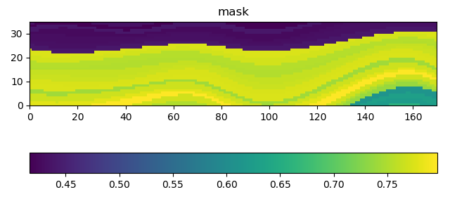
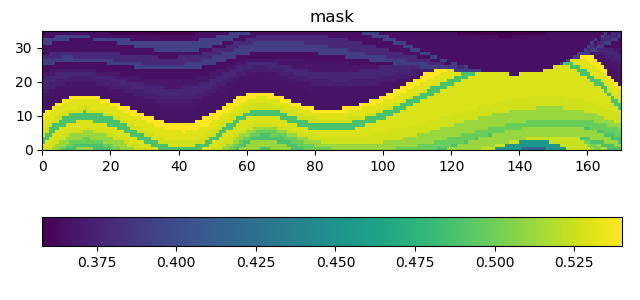
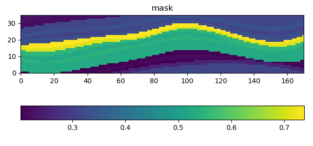

Набор `get_mask(170, 35, 5, 8, 3, 10)` даст заметно более мягкие распределения:

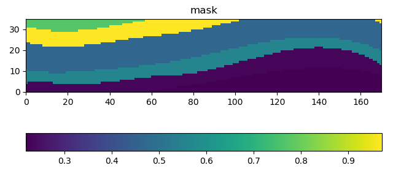
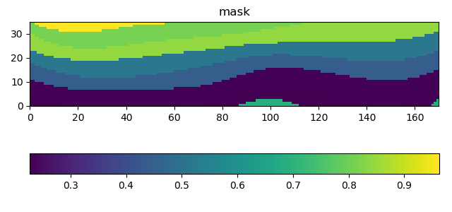
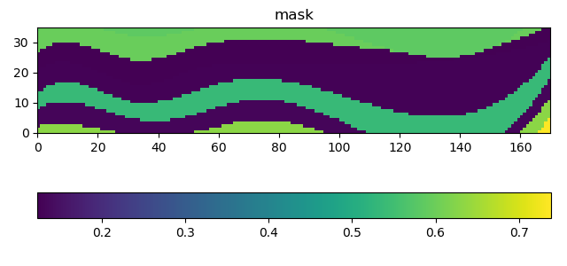

А врубив `get_mask(170, 35, 2, 8, 5, 10)` можно сгенерить какую-нибудь хтонь:

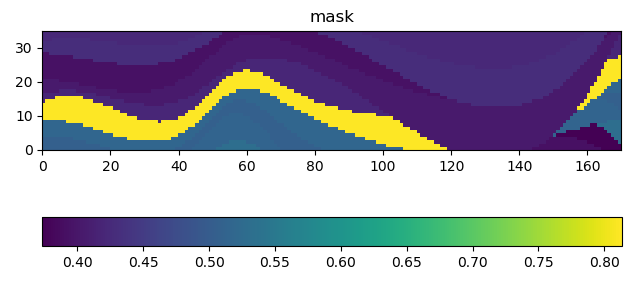
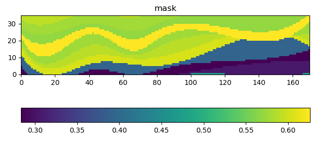
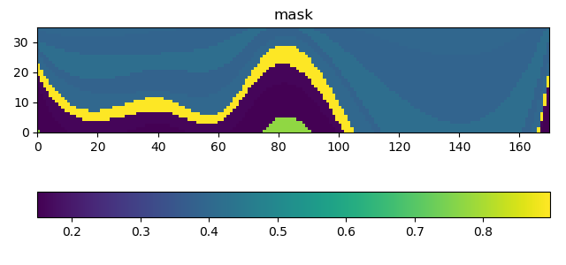